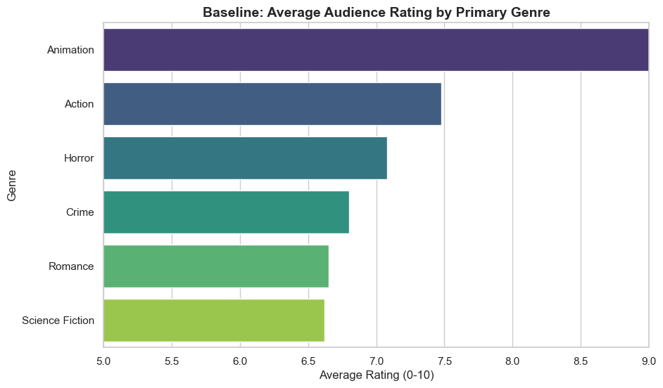
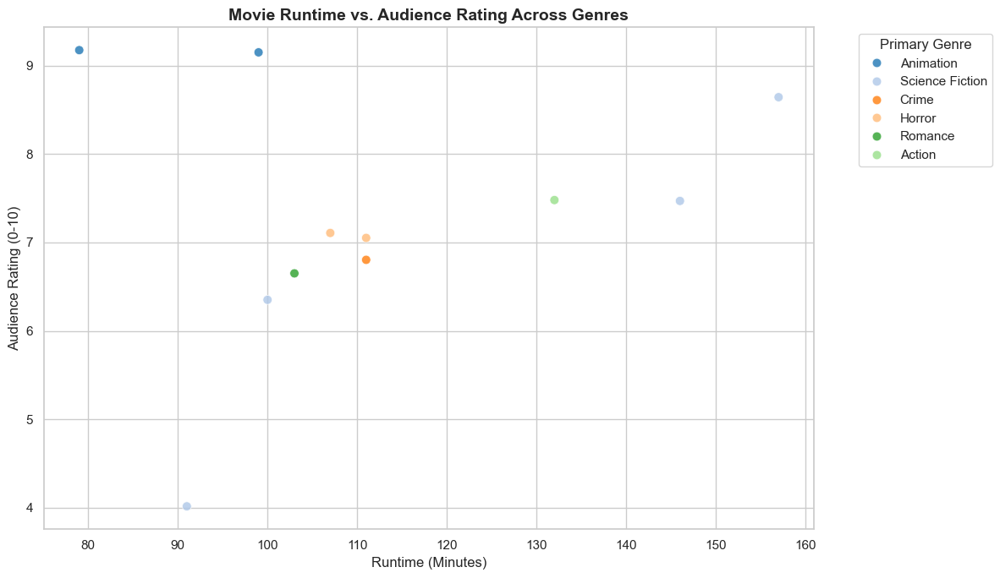

# Projects
This section documents my data science projects, research questions, and data stories I create throughout the semesters.

---
## Project 1 - Personal Portfolio (Part 1)

### 1. Defining the Problem
The main focus is to evaluate the reactions of the audience and find patterns across multiple movie genres using data from the TMDB API.

Furthermore, I want to look into one important question that I want to answer from this data: 
How does a movie's runtime correlate with its audience rating and how does this relationship remain consistent across different genres

Why is this question relevant? Well, this type of data can be really improtant for film studios, producers, and streaming platforms looking to optimize production budgets and find their ideal length of a film based on what movie genre they want to make to maximize audience satisfaction.

### 2. Data Description
This project relies on data extracted directly from The Movie Database (TMDB API). The unit of analysis is individual feature films.

**Key Variables Coceptualized and Operationalized**
* **Genre:** The category or style of the movie, measured by mapping TMDB's 'genre_ids' to their official string names via the TMDB Genre List API.
* **Audience Rating:** Audience enjoyment, measured by the 'vote_average' score (0-10).
* **Runtime:** The length of the movie, measured in minutes via the TMDB Movie Details API.
* **Vote Count:** The total number of audience members who rated the film, measured by the 'vote_count' field.

**Academic Context & References:**
1. Souza, T. L. D., Nishijima, M., & Fava, A. C. P. (2019). Do consumer and expert reviews affect the length of time a film is kept on screens in the USA? *Journal of Cultural Economics*, 43(1), 145-171.
2. McKenzie, J. (2023). The economics of movies (revisited): A survey of recent literature. *Journal of Economic Surveys*, 37(2), 480-525.
3. Sikdar, S., Kang, U., & O'Donovan, J. (2015). Statistical patterns in movie rating behavior. *PLOS ONE*, 10(8).

### 3. Data Cleaning and Preparation
To make sure the integrity of the analysis, several cleaning steps were executed using pandas:
1. **Handling Missing Values:** Any rows missing `runtime` or `vote_average` were dropped, as these are the core variables of the research question.
2. **Filtering Vote Counts:** Movies with fewer than 100 votes were removed. This trade-off reduces the overall dataset size but prevents obscure movies with a single 10/10 rating from artificially skewing the runtime-to-rating correlations.
3. **Primary Genre Extraction:** Because films often feature multiple overlapping genres, only the first (primary) `genre_id` was extracted to allow for clean categorical grouping when testing consistency across genres.

## 4 & 5. Visualizations, Insights, and Storytelling

To address how runtime impacts audience scores across genres, we must first establish a baseline. The bar chart reveals that **Animation** holds the highest average audience rating by a significant margin (~9.0), followed by **Action** (~7.5) and **Horror** (~7.1). Conversely, **Romance** and **Science Fiction** sit at the lower baseline end, both averaging around 6.6.

Building on that baseline, the scatter plot examining runtime versus rating demonstrates how movie length influences scores across specific genres. The visualization shows a tight cluster of mid-tier rated films—including **Horror**, **Crime**, and **Romance**—spanning the 103 to 111-minute runtime mark with scores hovering between 6.6 and 7.1. High-performing **Animation** films achieve top-tier ratings (>9.0) at concise run times under 100 minutes, whereas **Action** reaches its ~7.5 baseline at a longer runtime of 132 minutes. Notably, **Science Fiction** exhibits the widest rating variance in the dataset, swinging dramatically from a 4.0 rating at 91 minutes up to an 8.6 rating at 157 minutes.

### 6. Limitations, Ethics, and Reflection
While TMDB offers a massive repository of data, several limitations exist:
* **Genre Simplification:** Operationalizing a film by only its *primary* genre strips away meaning. A multi-genre film categorized solely by its first tag masks its true appeal and may skew genre-specific correlation results.
* **Demographic Bias:** TMDB ratings are crowd-sourced from its specific user base. These ratings do not represent a true random sample of the global population.
* **Next Steps:** If given more time, I would run regression lines for each specific genre on the scatter plot to see if the correlation strength changes dramatically between categories.

### 7. Code and Transparency
* **GitHub Repository:** https://github.com/EshanDK/data-science-portfolio
* **Data Source:** The Movie Database (TMDB) API
* **AI Usage Disclosure:** Generative AI was utilized strictly for reformatting / to concise my words, and for formatting my code + understanding certain elements to make sure they were used properly. All original ideas were made by me as well as all references come from previous materials/files made in class on canvas or previous VS Code files in DTSC 1301/1302.

---
## Project 2 - Personal Portfolio (Part 2)

### 1. Defining the Problem
In competitive esports like Valorant, every player fills a distinct role—whether that is entry-fragging on a Duelist, gathering info as an Initiator, locking down sites with a Sentinel, or smoking off sightlines on a Controller. A super interesting question in esports analytics is how player demographics play into these performance choices. 

Specifically, I wanted to answer two main questions:
1. How does a player's age correlate with their Average Combat Score (ACS)?
2. To what extent can player age predict their primary in-game role?

Why does this matter? Well, understanding how age relates to role specialization and overall combat output can actually be pretty huge for esports orgs, coaches, and analysts looking to build a balanced roster. Figuring out if younger players tend to lean toward aggressive Duelist roles or if older players shift into supportive, game-sense roles gives us a cool, data-driven look into career trajectories and team setups.

### 2. Background and Context
Tactical shooters demand a mix of raw motor reflexes, solid map awareness, and split-second decision-making. Research into reaction times and gaming performance shows that pure reaction speeds usually peak in a player's late teens to early twenties, after which players start relying a lot more on positioning, experience, and game sense. 

In Valorant, the roles ask for totally different playstyles:
* **Duelists** rely heavily on fast reaction times and taking aggressive opening fights.
* **Controllers** and **Sentinels** focus way more on utility setups, map control, and macro play.

This project builds on that domain knowledge to see if these age patterns actually pop up when looking at real professional match data.

**Academic Context & References:**
1. Thompson, J. J., Blair, M. R., & Henrey, A. J. (2014). Over the hill at 24: Longitudinal change in reaction time performance in *StarCraft 2*. *PLOS ONE*, 9(4), e94215.
2. Pluss, M. A., Novak, A. R., Bennett, K. J., Fransen, J., & Coutts, A. J. (2021). Signal over noise: Exploring physical and cognitive determinants of esports performance. *Journal of Sports Sciences*, 39(23), 2704-2716.
3. Taylor, T. L. (2012). *Raising the stakes: E-sports and the professionalization of computer gaming*. MIT Press.

### 3. Data Description
This project relies on data extracted directly from the VLRdevAPI, which tracks professional Valorant match statistics, tournament data, and player profiles.

**Key Variables Conceptualized and Operationalized**
* **Primary Role:** The main role category (Duelist, Initiator, Controller, Sentinel) assigned based on official match data, measured by encoding role strings into numerical codes (0-3).
* **ACS (Average Combat Score):** Overall in-game performance, measured as a continuous numeric score from official match histories.
* **Player Age:** Continuous predictor variable measuring exact player age in years from verified player records.

### 4. Data Preparation and Feature Selection
To make sure the integrity of the analysis, several cleaning steps were executed using pandas:
1. **Handling Missing Values and Duplicates:** Any rows missing age, ACS, or agent assignments were dropped, and duplicate player entries were removed to preserve data integrity.
2. **Target Encoding:** Categorical role strings were mapped into discrete integer codes (`Duelist: 0`, `Initiator: 1`, `Controller: 2`, `Sentinel: 3`) to allow processing by Scikit-Learn classifiers.
3. **Train/Test Split:** Data was separated using an 80/20 train-test split with `random_state=42` to ensure reproducibility and prevent data leakage.

### 5 & 6. Visualizations, Insights, and Storytelling
Looking at the summary stats, the average player age sat right around 22.5 years old, ranging from 18 to 28. Average Combat Scores (ACS) centered around a mean of ~210, stretching anywhere from 170 up to nearly 300 (with one high peak around 294 at age 24).

Looking at the scatter plot examining player age versus ACS, the fitted linear regression line shows a subtle positive slope coefficient of +1.60 and an intercept of 174.15. Moving across the age spectrum, the fitted baseline rises from roughly 203 ACS at age 18 up to around 219 ACS at age 28. However, the data points show widespread variance across all age brackets, resulting in an MSE of 316.53 and an R-squared score of -0.09, proving that age alone is not a reliable predictor for combat performance.

Building on that baseline, the Decision Tree Classifier predicts player in-game roles based on age splits, achieving an overall accuracy of 30% (0.30) on the test set. The tree sets clear decision boundaries at age thresholds of <= 21.5, <= 20.5, <= 24.5, and <= 26.5. Duelist (class 0) performed best with a precision of 0.67 and recall of 0.50 (F1-score of 0.57). Younger age branches (<= 20.5) lean toward Initiators and Duelists, while older decision nodes (<= 24.5 and <= 26.5) shift players into Controller and Sentinel categories.

### 7. Limitations, Ethics, and Reflection
While VLRdevAPI offers a great repository of esports data, several limitations exist:
* **Role Simplification:** Assigning a player just one primary role strips away meaning. Flex players swap agents depending on map layouts, so forcing them into a single category hides their tactical adaptability.
* **Demographic Bias & Patch Shifts:** API data reflects current meta trends, which change constantly whenever balance patches drop.
* **Next Steps:** If given more time, I would pull in extra features like headshot percentage, utility usage stats, and tournament tier levels to build a multi-feature random forest model.

### 8. Code and Transparency
* **GitHub Repository:** https://github.com/EshanDK/data-science-portfolio
* **Data Source:** VLRdevAPI (Documentation: https://vlrdevapi.pages.dev/docs/)
* **AI Usage Disclosure:** Generative AI was utilized strictly for reformatting / to concise my words, and for formatting my code + understanding certain elements to make sure they were used properly. All original ideas were made by me as well as all references come from previous materials/files made in class on canvas or previous VS Code files in DTSC 1301/1302.
